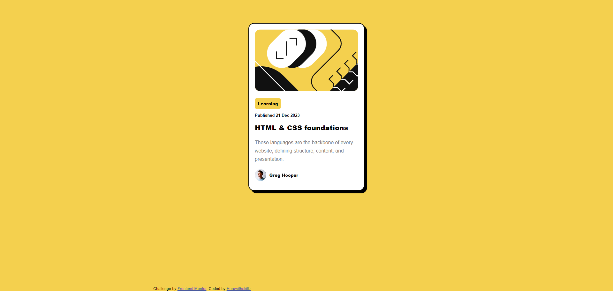
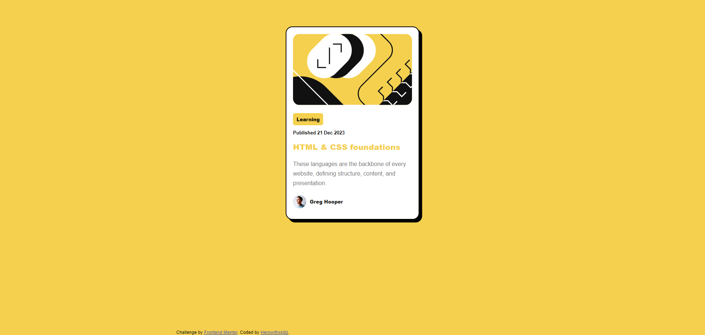

# Frontend Mentor - Blog preview card solution

This is a solution to the [Blog preview card challenge on Frontend Mentor](https://www.frontendmentor.io/challenges/blog-preview-card-ckPaj01IcS). Frontend Mentor challenges help you improve your coding skills by building realistic projects. 

## Table of contents

- [Overview](#overview)
  - [The challenge](#the-challenge)
  - [Screenshot](#screenshot)
  - [Links](#links)
  - [Built with](#built-with)
  - [What I learned](#what-i-learned)
  - [Author](#author)

## Overview

Blog preview card challenge was an interesting one. It helped in exploring ways to write cleaner codes.

### The challenge

Users should be able to:

- See hover and focus states for all interactive elements on the page

### Screenshot

### Links

- Solution URL: [https://github.com/HerowithSkillz/Blog-preview-card-Challenge]
- Live Site URL: [https://herowithskillz.github.io/Blog-preview-card-Challenge/]

### Built with

- Semantic HTML5 markup
- CSS custom properties
- Flexbox

### What I learned

Increased my insights of using various custom properties of CSS and improve my efficiency while coding.

## Author

- Frontend Mentor - [@HerowithSkillz](https://www.frontendmentor.io/profile/HerowithSkillz)

